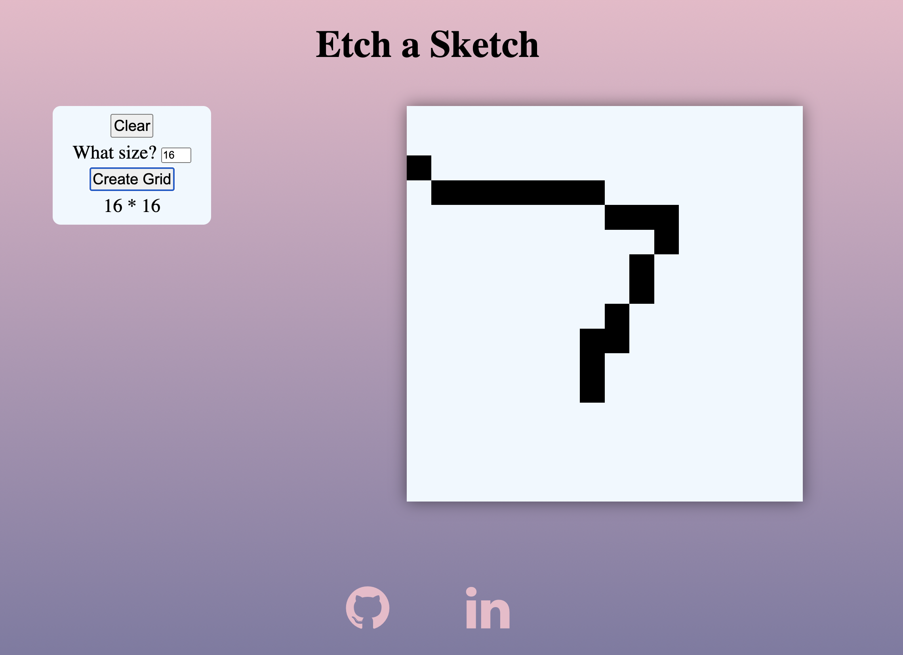

<h1>Etch-A-Sketch</h1>

First Project I made that implemented JavaScipt. This project was part of The Odin Project cirriculum

<h2><a href="https://taztheprogrammer.github.io/Etch-a-Sketch/">Website Preview Here</a></h2>

<h2 style="text-align: center">Features</h2>
<ul>
  <li>Board is colored through drag motion of the mouse</li>
  <li>Clear board Feature</li>
  <li>Grid size adjustment Feature</li>
  <li>Size responsive design</li>
</ul>
<h2>Outcomes</h2>
<ul>
  <li>Manipulated DOM with JavaScript</li>
  <li>Utlized HTML and CSS for design</li>
  <li>Implemented Event Listener</li>
</ul>
<h2>Links</h2>
<ul>
  <li>Next Project <a href="https://github.com/taztheprogrammer/Library">Library App</a></li>
  <li>Previous Project <a href="https://github.com/taztheprogrammer/odin-recipes">Recipe Page</a></li>
</ul>
